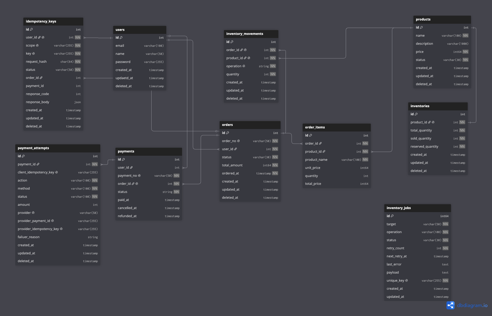
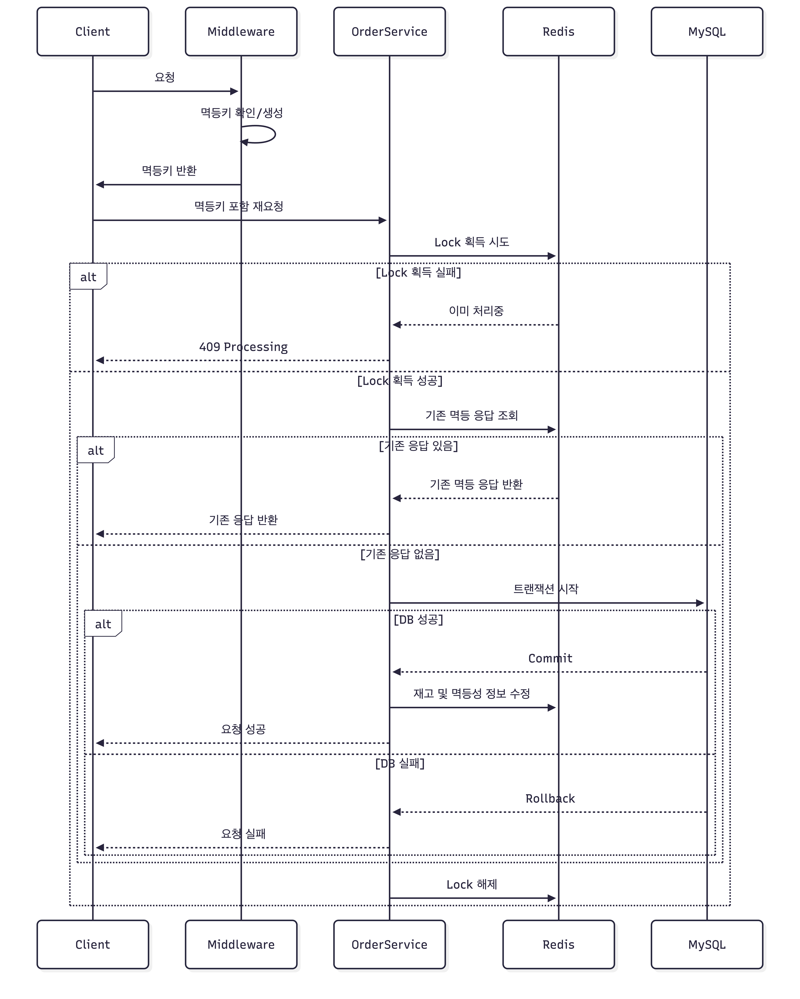

# Order & Payment System

주문 생성부터 결제 승인, 결제 실패, 주문 취소 및 환불까지의 흐름을 구현한
Golang 기반 백엔드 포트폴리오 프로젝트입니다.

단순 CRUD 구현보다 주문과 결제 상태가 서로 어긋나지 않도록 관리,
중복 요청 처리, 트랜잭션 경계, 외부 결제 시스템 연동 시 발생할 수 있는 실패 상황을 다루는 데 주의를 기울였습니다.


## 프로젝트 목표
- 주문과 결제의 상태 변경 규칙을 정의한다.
- 주문, 결제 요청의 중복 처리로 인한 이중 요청 처리를 방지한다.
- 주문, 결제, 재고 변경의 트랜잭션 경계를 고민한다.
- 외부 결제 시스템의 실패와 응답 불확실성을 처리한다.

## 기술 스택
| 구분            | 기술      | 사용 목적                  |
|---------------|---------|------------------------|
| Language      | Golang  | 백엔드 개발                 |
| Web           | Gin     | 라우팅 및 웹 서버             |
| ORM           | GORM    | MySQL 데이터 접근 및 트랜잭션 처리 |
| RDBMS         | MySQL   | 주문, 결제, 환불 데이터의 정합성 관리 |
| In-Memory DB  | Redis   | 주문, 결제 멱등성 관리 및 캐싱     |


## 실행 방법

### Docker Compose
```bash
docker compose up --build
```

API 서버와 worker 서버가 각각 `api`, `worker` 컨테이너로 실행됩니다.

```bash
docker compose ps
docker compose logs -f api
docker compose logs -f worker
```

백그라운드 실행:
```bash
docker compose up -d --build
```

종료:
```bash
docker compose down
```

### 로컬 실행
```
1. go run ./cmd/api
2. go run ./cmd/worker
```
### 환경변수
```aiignore
APP_PORT=8080

MYSQL_DB_HOST=localhost
MYSQL_DB_PORT=3306
MYSQL_DB_USER=root
MYSQL_DB_PASS=test_password
MYSQL_DB_NAME=test_database

REDIS_HOST=localhost
REDIS_PORT=6379

JWT_SECRET=random_jwt_secret

SLACK_WEBHOOK_URL=
TOSS_SECRET_KEY=
```

## API EndPoints
| Method | EndPoint                             | Description       |
|--------|--------------------------------------|-------------------|
| POST   | /api/v1/idempotencies                | 멱등키 생성            |
| POST   | /api/v1/products                     | 상품 생성             |
| GET    | /api/v1/products/`:productID`        | 상품 정보 조회          |
| PUT    | /api/v1/products/`:productID`        | 상품 수정             |
| DELETE | /api/v1/products/`:productID`        | 상품 삭제             |
| POST   | /api/v1/orders                       | 주문 요청             |
| DELETE | /api/v1/orders/`:orderID`            | 주문 취소             |
| POST   | /api/v1/payments                     | 결제 요청             |
| PUT    | /api/v1/payments/`:paymentID`/refund | 환불 요청             |
| POST   | /api/v1/register                     | 회원가입              |
| POST   | /api/v1/auth/login                   | 로그인               |
| POST   | /api/v1/auth/refresh                 | refresh token 재발급 |
| DELETE | /api/v1/auth/logout                  | 로그아웃              |

## 요청 예시
[CURL 예시](docs/request/curl.md)

## 구조

### 디렉터리 구조
```
.
└── order-system/
    ├── cmd/
    │   ├── api/
    │   └── worker/
    └── internal/
        ├── config/
        ├── database/
        ├── redis/
        ├── order/
        │   ├── handler/
        │   ├── service/
        │   ├── repository/
        │   ├── domain/
        │   └── ...
        ├── payment/
        ├── worker/
        ├── pkg/
        ├── registry/
        └── ...
```

### 아키텍처

HTTP 요청 처리 흐름 계층
`Middleware -> Handler -> Service -> Repository -> Database`
- Handler: HTTP 요청 파싱, 검증 결과 전달, 응답 생성
- Service: 주문 결제 비즈니스 규칙과 트랜잭션 조정
- Repository: 영속성에 대한 데이터 접근
- Middleware: 인증, 요청 추적, 멱등키 처리

### 주요 설계 포인트
- 멱등키 기반 중복 요청 방지
- 주문/결제/재고 트랜잭션 경계
- PG 응답 실패 유형 분리
- 재고 복구 실패 시 비동기 Job 재시도 처리
- 알림을 통한 장애 감지

### ERD


[DDL 확인](docs/database/ddl.md)


## 핵심 기능
### 주문 요청
- 인증된 사용자의 주문 생성 요청을 처리한다.
- 멱등키와 요청 본문 해시, Redis 락을 검증해 동일 주문의 중복 처리를 방지한다.
- 요청값과 실제 데이터 비교를 통해 요청값을 검증한다.
- Redis 재고를 먼저 예약하고, 주문/주문상품/멱등성/DB 예약 재고를 트랜잭션으로 저장한다.
- 주문 생성 실패 시 예약 재고를 복구하고, 복구 실패 건은 재시도 작업으로 등록한다.
- 주문 생성 후 일정 시간 내 결제가 완료되지 않으면 주문을 자동 취소하고 예약 재고를 복구한다.

### 주문 취소
- 사용자가 요청한 주문 ID와 주문번호, 사용자 소유권을 기준으로 취소 가능 여부를 검증한다.
- 결제 전 `PENDING` 상태의 주문만 취소 처리한다.
- 주문 취소와 멱등성 상태 취소, DB 예약 재고 복구를 하나의 트랜잭션으로 처리한다.
- 트랜잭션 성공 후 Redis 예약 재고를 복구한다.
- 재고 복구 실패 시 알림을 전송하고, 재시도 가능한 작업은 별도 Job으로 등록한다.

### 결제 요청
- 인증된 사용자의 결제 요청을 처리한다.
- 멱등키, 요청 해시, Redis 락을 이용해 중복 결제 요청을 방지한다.
- 주문 소유자와 결제 요청 사용자가 같은지 확인한다.
- 결제 정보와 결제 시도 이력을 생성하고, 멱등키와 결제 정보를 연결한다.
- PG 결제 승인 요청 결과에 따라 결제, 결제 시도, 주문, 멱등성 상태를 갱신한다.
- 결제 성공 시 주문을 `COMPLETED`로 변경하고 예약 재고를 판매 재고로 반영한다.
- PG 거절, 서버 오류, PG 오류, 불명 상태를 구분해 실패 상태와 후속 처리를 수행한다.

### 결제 환불
- 성공한 결제 건을 조회하고, 사용자 소유권과 주문번호 일치 여부를 검증한다.
- 멱등키, 요청 해시, Redis 락을 이용해 중복 처리를 방지한다.
- 환불 시도 이력을 생성하고 멱등성 상태를 갱신한다.
- PG 환불 요청 결과에 따라 환불 시도와 멱등성 상태를 갱신한다.
- 환불 성공 시 결제 환불을 기록하고 판매 재고를 차감한다.
- 환불 상태 갱신 실패 시 재시도 후, 실패 정보는 알림으로 전송한다.


## 주요 기능 흐름

```
아래 4개의 요청에 동일한 응답을 제공하기 위해 락 및 멱등키를 사용합니다.

- 주문 요청
- 주문 취소
- 결제 요청
- 환불 요청
```

### 흐름
> 4개 요청에 대한 큰 흐름은 아래 시퀀스 다이어그램처럼 전달됩니다.



### 상태 전이
- 주문: `PENDING -> COMPLETED / FAILED / CANCELLED`
- 결제: `PROCESSING -> SUCCEEDED / REJECTED / FAILED`
- 환불: `PROCESSING -> SUCCEEDED / REJECTED / FAILED`
